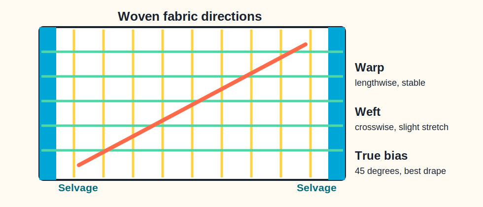

# Fundamentals of Fabrics

The first skill in Fabric Studies is learning to see direction, edge, stretch and garment construction details. These terms help students cut accurately, fit garments better and communicate clearly in studio.

## Fabric directions

| Term | Meaning | Design importance |
| --- | --- | --- |
| Grain | Direction or orientation of yarns in woven fabric. | Correct grain helps garments hang and fit properly. |
| Lengthwise grain / Warp | Yarns running parallel to the selvage. | Strong, stable and usually used vertically in garments for durability. |
| Crosswise grain / Weft / Filling | Yarns running at right angles to the selvage. | Usually has a slight stretch and is slightly weaker than warp. |
| Selvage / Selvedge | Smooth finished edge at both lengthwise sides of woven fabric. | Helps identify warp direction and prevents edge fraying. |
| Bias | Any diagonal direction across lengthwise and crosswise yarns. | Gives greater elasticity than straight grain. |
| True bias | A 45 degree angle to lengthwise and crosswise grains. | Best for flares, cowls, drapes and garments that need graceful body contouring. |
| Perfect grain fabric | Warp and weft cross at right angles. | Preferred for cutting because the garment falls well and lasts longer. |

!!! tip "Studio observation"
    Knit fabrics are made from continuous loops rather than two interlaced yarn sets, so they do not technically have grain in the same way woven fabrics do.

## Garment construction vocabulary

  <article><h3>Seam</h3>
A stitching line formed by joining two pieces of fabric.
</article>
  <article><h3>Seam line</h3>
The line that indicates where the seam should be stitched.
</article>
  <article><h3>Seam allowance</h3>
Extra fabric between the raw edge and stitching line to protect the seam from fraying.
</article>
  <article><h3>Seam finish</h3>
A treatment applied to raw seam edges, such as overlocking, edge stitching, pinking or turning and stitching.
</article>
  <article><h3>Fray</h3>
Threads that come out from the raw fabric edge during handling.
</article>
  <article><h3>Basting / Tacking</h3>
Temporary long stitches or pins used to hold fabric before final stitching.
</article>

## Garment detail vocabulary

| Term | Meaning |
| --- | --- |
| Clothing | Items of apparel and adornment used to cover or decorate the body. |
| Tailored garments | Cut and sewn garments shaped to conform to the body. |
| Ready-to-wear garments | Mass-produced garments made in standard sizes. |
| Draped garments | Clothing that hangs in loose folds around the body and may be tied or fastened rather than shaped by cutting. |
| Neckline | Opening and frame around the neck; may be symmetrical, asymmetrical, deep, wide or raised. |
| Armhole | Opening in the garment through which the arm passes. |
| Sleeve | Covering for the arm attached at or near the armhole. |
| Cuff | Fabric band that finishes or decorates the lower edge of a sleeve. |
| Placket | Finished garment opening that helps the wearer put on or take off a garment. |
| Pocket | Small pouch sewn onto or into a garment for functional or decorative use. |
| Yoke | Fitted panel at shoulder, waist or midriff to which the rest of the garment is joined. |
| Hemline | Lower edge line of a garment, such as a skirt, dress or coat. |
| Dart | Triangular stitched fold that shapes flat fabric to body curves. |
| Tuck | Slender stitched fold of fabric, often decorative and made on straight grain. |
| Pleat | Unstitched fold made of three fabric layers to control fullness and add shape. |
| Gathers | Small soft folds made by drawing up fabric along a stitching line. |

## Quick design judgement

  
<strong>Before cutting fabric, ask:</strong>

  <ul>
    <li>Is the fabric on perfect grain?</li>
    <li>Where is the selvage?</li>
    <li>Does this garment part need stability or drape?</li>
    <li>Should it be placed on lengthwise grain, crosswise grain or true bias?</li>
    <li>Does the seam allowance suit the fabric's tendency to fray?</li>
  </ul>

