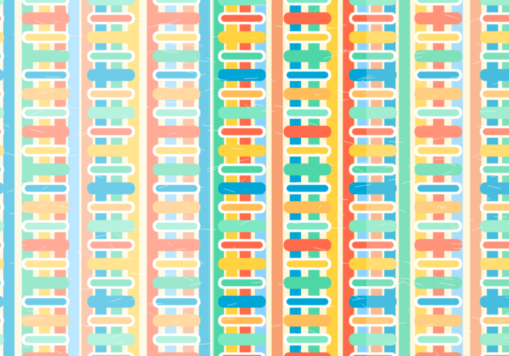

---
hide:
  - toc
---

<section class="hero-panel">
  

    
Undergraduate Fashion Design

    <h1>Fabric Studies</h1>
    
A bright, visual learning space for understanding how fibres become fabrics, how fabrics behave, and how that knowledge supports good garment decisions.

    
<a class="primary-action" href="introduction/">Begin the module</a>

  

  
</section>

<section class="module-grid" markdown>
  <article>
    01
    <h2>Language of Fabric</h2>
    
Grain, bias, selvage, seam allowance, dart, tuck, pleat, gathers, yoke, placket, neckline and other garment terms.

  </article>
  <article>
    02
    <h2>Fabric Formation</h2>
    
Weaving, knitting, bonding and the way construction method changes drape, stretch, strength and surface.

  </article>
  <article>
    03
    <h2>Fibre Families</h2>
    
Cotton, wool, silk, rayon, nylon, polyester and acrylic compared through process, properties and end uses.

  </article>
  <article>
    04
    <h2>Practice</h2>
    
A randomised quiz helps students revise terminology, fibre properties and fabric construction before class or studio work.

  </article>
</section>

## How to use this site

Use the left navigation as a learning path. Start with the Introduction, move into Fundamentals, then compare fabric formation methods and fibre families. The final page generates a fresh set of quiz questions whenever it is opened.

  <strong>Professor's teaching cue:</strong> Ask students to keep one fabric swatch beside them while reading each page. Every concept becomes clearer when it is touched, bent, stretched and observed.

