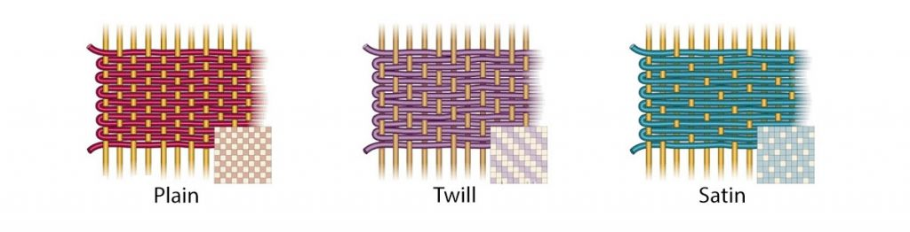

# Methods of Fabric Formation

Fabrics can be made from yarns or directly from fibres. The formation method affects structure, stretch, stability, porosity, surface texture and end use.

## Main formation methods

| Method | Basic principle | Typical behaviour |
| --- | --- | --- |
| Weaving | Two yarn sets interlace at right angles. | Stable, strong, clear grain direction, often limited stretch except on bias. |
| Knitting | One or more yarns form interlooped structures. | Flexible, looped, stretchier and comfortable for body movement. |
| Felts and non-wovens | Fibres are joined directly without first becoming yarn. | Useful for technical, disposable, medical, home and industrial materials. |
| Other methods | Nets, laces, braids, tapa cloth, quilts, bonded and laminated materials. | Often selected for surface effect, openness, layering or performance. |

## Weaving

Woven fabrics are produced by interlacing lengthwise warp yarns and widthwise weft yarns on a loom. The lengthwise edges are selvages, and the grain direction runs parallel to the warp. The true bias lies at 45 degrees to both warp and weft and gives woven fabrics their best drape.

### Loom parts and motions

| Part or motion | Role |
| --- | --- |
| Warp beam | Holds the wound warp yarns at the back of the loom. |
| Harness and heddles | Raise and lower warp yarns to create the shed. |
| Shedding | Opening the warp yarns so the weft can pass through. |
| Picking | Inserting the weft yarn through the shed, by shuttle or shuttle-less systems. |
| Reed and beating up | Push the newly inserted weft into place to compact the fabric. |
| Let off | Slow unwinding of warp from the warp beam. |
| Take up | Winding the woven fabric onto the cloth beam. |

### Basic weaves

  <section>
    <h3>Plain weave</h3>
    
The simplest weave, with warp and weft interlacing alternately. It has maximum interlacement, giving firmness and stability.

    
<strong>Examples:</strong> cambric, muslin, canvas, shirting, suiting, sarees and dhothi fabrics.

  </section>
  <section>
    <h3>Twill weave</h3>
    
Recognised by diagonal line formation. It has fewer interlacements than plain weave, often giving better drape and greater weight.

    
<strong>Examples:</strong> denim, drill cloth, khaki uniforms, blankets, shirtings and furnishings.

  </section>
  <section>
    <h3>Satin / Sateen weave</h3>
    
Uses floating yarns to create a smooth lustrous surface. The fabric may be warp-faced or weft-faced.

    
<strong>Examples:</strong> ribbons, trimmings, dresses and linings.

  </section>

## Knitting

Knitted fabrics are made by interlooping yarns. New loops are drawn through previous loops, forming a continuous flexible structure. Commercial knitting may be done on flat-bed or circular knitting machines.

| Knit term | Meaning |
| --- | --- |
| Wale | Vertical column of loops, comparable to warp direction in woven fabric. |
| Course | Horizontal row of loops, comparable to weft direction in woven fabric. |
| Stitch | One loop, with head, legs and feet. |
| Count | Total wales and courses per square inch. |
| Gauge | Fineness of fabric, measured by stitches or needles per unit width. |

### Weft and warp knits

| Type | Structure | Examples |
| --- | --- | --- |
| Weft knits | Yarns run horizontally across the fabric; all stitches in a course are formed by one yarn. | Jersey for sportswear and T-shirts; purl for children's wear; rib for sleeve bands, waist bands and necklines. |
| Warp knits | Yarns form vertical loops and move diagonally to the next wale; each stitch in a course is made by a different yarn. | Tricot for lingerie and blouses; Raschel for nets, laces, curtains and upholstery; simplex for handbags and gloves. |

## Bonding

Bonded fabric is a non-woven or composite material made by joining fibres or fabric layers through heat, mechanical action or chemical processes. Bonding can improve strength, stiffness, durability and performance.

| Bonded process | Description | End uses from notes |
| --- | --- | --- |
| Dry-laid | A fibrous web is felted with heat, moisture and agitation. | Baby wipes, tampons, medical textiles, diapers and adult incontinence products. |
| Wet-laid | Similar to paper making, using chopped staple fibres or continuous synthetic material. | Napkins, surgical gauze, tea bag fabrics, filter fabrics, aprons and gloves. |
| Melt or spun melt | Polymer is melted and passed through spinnerets to form yarns or fibrous sheets. | Face masks, surgical gowns, filters, warm filling, packaging and sanitary materials. |

### Advantages and limitations

  <section>
    <h3>Advantages</h3>
    <ul>
      <li>Enhanced strength and durability</li>
      <li>Better stability and surface properties</li>
      <li>Wear and tear resistance</li>
      <li>Water resistance and improved insulation</li>
      <li>Easy care and crease resistance</li>
    </ul>
  </section>
  <section>
    <h3>Limitations</h3>
    <ul>
      <li>Low air permeability</li>
      <li>Compact structure</li>
      <li>Pilling with friction</li>
      <li>Poor breathability</li>
      <li>Possible delamination</li>
    </ul>
  </section>

